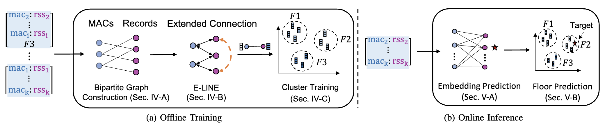

Official implementation of the ICDCS2022 paper: GRAFICS: Graph Embedding-based Floor Identification Using Crowdsourced RF Signals

Weipeng Zhuo, Ziqi Zhao, Ka Ho Chiu, Shiju Li, Sangtae Ha, Chul-Ho Lee, S.-H. Gary Chan

[IEEE page](https://ieeexplore.ieee.org/abstract/document/9912243), [Arxiv](https://arxiv.org/abs/2210.07895)

## Overview

We study the problem of floor identification for radiofrequency (RF) signal samples obtained in a crowdsourced manner, where the signal samples are highly heterogeneous and most samples lack their floor labels. We propose GRAFICS, a graph embedding-based floor identification system. GRAFICS first builds a highly versatile bipartite graph model, having APs on one side and signal samples on the other. GRAFICS then learns the low-dimensional embeddings of signal samples via a novel graph embedding algorithm named E-LINE. GRAFICS finally clusters the node embeddings along with the embeddings of a few labeled samples through a proximity-based hierarchical clustering, which eases the floor identification of every new sample. We validate the effectiveness of GRAFICS based on two large-scale datasets that contain RF signal records from 204 buildings in Hangzhou, China, and five buildings in Hong Kong. Our experiment results show that GRAFICS achieves highly accurate prediction performance with only a few labeled samples (96% in both micro- and macro-F scores) and significantly outperforms several state-of-the-art algorithms (by about 45% improvement in micro-F score and 53% in macro-F score).



## Getting Started

To run the code, make sure you have installed the following packages:

```
tensorflow 1.15
numpy
prettytable
networkx
numba
scikit-learn
matplotlib
```

You can also use ```pip install -r requirements.txt``` to install necessary packages.

### A quick start

You can run the code below in a sequential order:

1. folder_init.py
2. prep_node.py     
3. prep_graph.py 
4. get_floors.py
5. gen_emb_eline.py
6. main_embedding.py

Configurations are placed in const.py.

We provide an example dataset in ```data```, with ```readme.md``` in each subfolder. You can add your own dataset for testing, for example the dataset from [Microsoft indoor localization & navigation competition](https://www.kaggle.com/c/indoor-location-navigation).

## Bibliography

If you find this work useful, please consider citing it.

```
@INPROCEEDINGS{zhuo2022grafics,
  author={Zhuo, Weipeng and Zhao, Ziqi and Ho Chiu, Ka and Li, Shiju and Ha, Sangtae and Lee, Chul-Ho and Gary Chan, S.-H.},
  booktitle={2022 IEEE 42nd International Conference on Distributed Computing Systems (ICDCS)}, 
  title={GRAFICS: Graph Embedding-based Floor Identification Using Crowdsourced RF Signals}, 
  year={2022},
  volume={},
  number={},
  pages={1051-1061},
  doi={10.1109/ICDCS54860.2022.00105}}
```